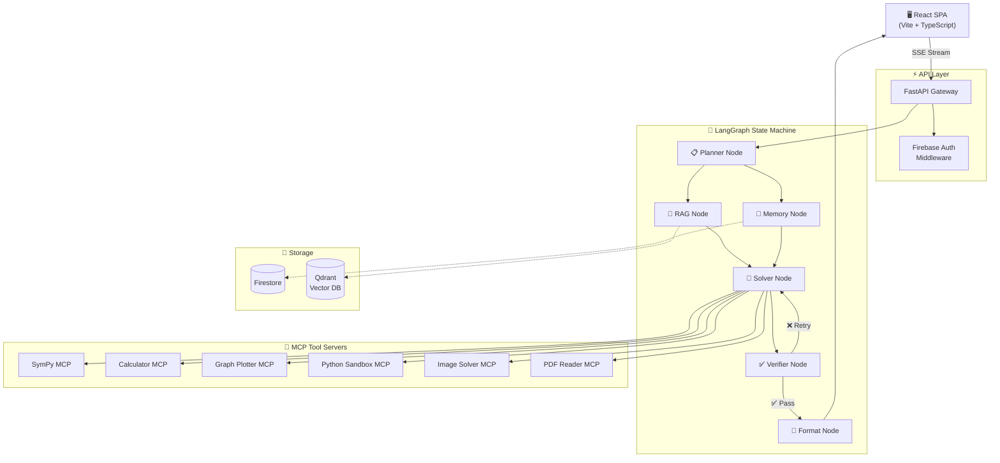
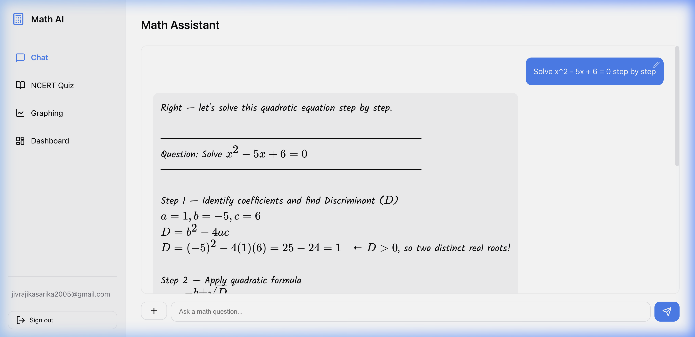
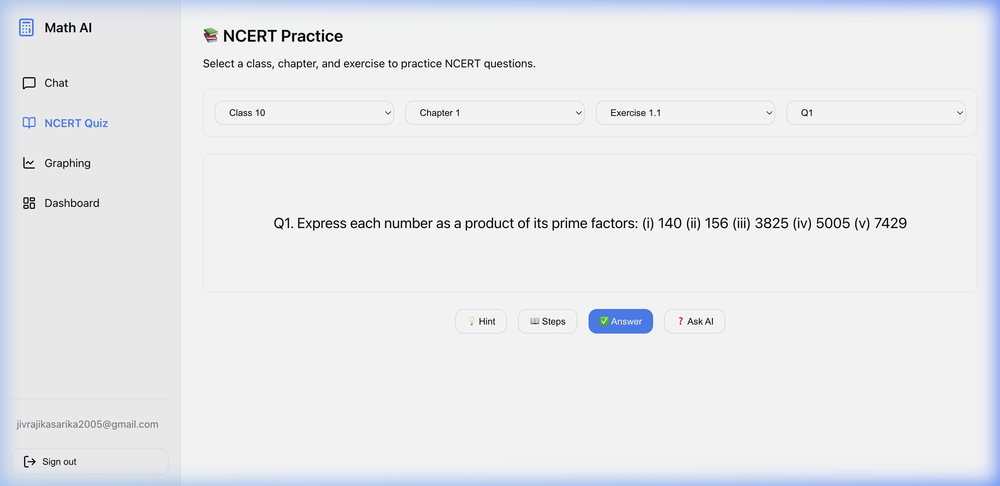
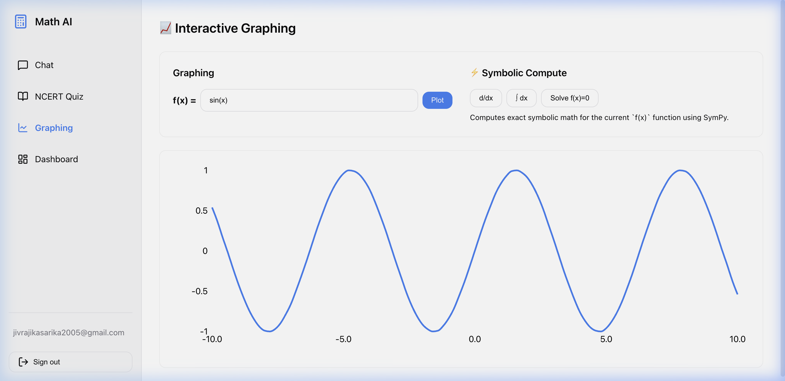
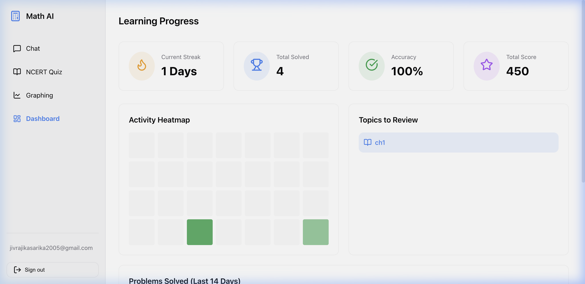

<div align="center">

  

  # 🧮 Agentic Math Solver

  **A multi-agent AI mathematics tutor with LangGraph orchestration, MCP tooling, and a premium React UI — built for students, powered by Gemini & Groq.**

  [](https://advanced-math-ai.vercel.app)
  [](https://false45-math-api.hf.space/docs)
  [](LICENSE)
  [](https://python.org)
  [](https://react.dev)
  [](https://fastapi.tiangolo.com)
  [](Dockerfile)
  [](tests/)

</div>

<br />

<div align="center">
  <strong>
    <a href="#-features">Features</a> · 
    <a href="#-architecture">Architecture</a> · 
    <a href="#-tech-stack">Tech Stack</a> · 
    <a href="#-screenshots">Screenshots</a> · 
    <a href="#-getting-started">Getting Started</a> · 
    <a href="#-roadmap">Roadmap</a> · 
    <a href="#-contributing">Contributing</a>
  </strong>
</div>

<br />

---

## ✨ Features

| | Feature | Description |
| :---: | :--- | :--- |
| 🧠 | **Intelligent Math Chat** | Real-time AI tutor with step-by-step reasoning. Renders complex equations perfectly via LaTeX (KaTeX). Powered by a LangGraph multi-agent pipeline with plan → solve → verify → format stages. |
| 📸 | **Multimodal Input** | Upload PDFs or use your camera to scan handwritten math problems. Google Gemini Vision extracts and solves them instantly. |
| 📚 | **NCERT Quiz Engine** | Interactive MCQs for Class 9–10 students powered by **Qdrant Vector DB** and **RAG** (Retrieval-Augmented Generation). |
| 📐 | **Symbolic Math Engine** | Dedicated SymPy computation engine — differentiate, integrate, find roots, and plot 2D function graphs dynamically. |
| 📈 | **Progress Dashboard** | Tracks streaks, accuracy, and weak topics with **Firebase Auth** + a live **Recharts** line graph. |
| 🔗 | **MCP Tool Servers** | 6 sandboxed Model Context Protocol servers (SymPy, Calculator, Graph Plotter, Python Executor, Image Solver, PDF Reader) give the AI real computation power instead of hallucinating math. |
| 🎨 | **Premium UI/UX** | Dark-mode-first React SPA with glassmorphism, micro-animations, and mobile-responsive design via Vite. |

---

## 🏗 Architecture

The system uses **LangGraph** for stateful multi-agent orchestration, with **Google ADK agents** as specialized reasoning nodes and **MCP servers** as sandboxed tool backends.



> **How it works:** The user's question enters the LangGraph state machine. The **Planner** classifies it, the **RAG** and **Memory** nodes fetch relevant context in parallel, the **Solver** generates a solution using MCP tools for real computation, the **Verifier** checks correctness (retrying up to 3× if wrong), and the **Formatter** adds LaTeX styling before streaming back to the client.

---

## 💻 Tech Stack

### Frontend


- **KaTeX** — LaTeX math rendering
- **Recharts** — interactive data visualization
- **Lucide React** — modern icon library
- **React Markdown** — rich text formatting

### Backend


- **LangGraph** — multi-agent state machine orchestration
- **Google ADK** — agent development kit for specialized reasoning
- **Gemini 2.5 Flash** — primary LLM (multimodal)
- **Groq (Llama 3.3 70B)** — fast inference fallback
- **SymPy** — symbolic mathematics engine
- **Qdrant** — vector database for NCERT RAG
- **Firebase Admin** — Firestore + Auth

### DevOps


- **CI/CD** — GitHub Actions with automated testing
- **Backend Hosting** — Hugging Face Spaces (Docker)
- **Frontend Hosting** — Vercel
- **Containerization** — Docker + Docker Compose

---

## 📸 Screenshots

<div align="center">
  <table>
    <tr>
      <td align="center"><b>💬 AI Chat (Math Solving)</b><br/></td>
      <td align="center"><b>📚 NCERT Quiz Engine</b><br/></td>
    </tr>
    <tr>
      <td align="center"><b>📐 Interactive Graphing (SymPy)</b><br/></td>
      <td align="center"><b>📊 Learning Dashboard</b><br/></td>
    </tr>
  </table>
</div>


---

## 🚀 Getting Started

### Prerequisites

- **Python 3.9+** and pip
- **Node.js 18+** and npm
- **Docker** (optional)

### Option 1 — Docker Compose (Recommended)

```bash
# Clone the repository
git clone https://github.com/Sarika-stack23/agentic-math-solver.git
cd agentic-math-solver

# Configure environment
cp .env.example .env
# Edit .env with your API keys (GEMINI_API_KEY, GROQ_API_KEY, etc.)

# Start all services
docker compose up --build
```

| Service | URL |
| :--- | :--- |
| Backend API | `http://localhost:8080` |
| API Docs (Swagger) | `http://localhost:8080/docs` |
| Frontend | `http://localhost:5173` |

### Option 2 — Local Development

#### Backend

```bash
cd backend
python3 -m venv venv
source venv/bin/activate        # macOS/Linux
# venv\Scripts\activate         # Windows

pip install -r requirements.txt

# Configure environment
cp ../.env.example ../.env
# Edit .env with your API keys

uvicorn src.main:app --reload --port 8080
```

#### Frontend

```bash
cd frontend
npm install

# Create frontend .env
echo "VITE_API_URL=http://localhost:8080" > .env

npm run dev
```

### Environment Variables

| Variable | Required | Description |
| :--- | :---: | :--- |
| `GEMINI_API_KEY` | ✅ | [Google AI Studio](https://aistudio.google.com/apikey) — free tier available |
| `GROQ_API_KEY` | ✅ | [Groq Console](https://console.groq.com/keys) — free tier available |
| `USE_GEMINI` | — | Set to `true` to use Gemini as primary model (default: `true`) |
| `USE_FIREBASE` | — | Set to `true` to enable Firebase Auth + Firestore |
| `FIREBASE_CREDENTIALS_PATH` | — | Path to Firebase Admin SDK JSON file |

---

## 📁 Directory Structure

```text
agentic-math-solver/
├── backend/
│   ├── src/
│   │   ├── agents/           # ADK agent definitions (Planner, Solver, Verifier, etc.)
│   │   ├── api/              # FastAPI routes (chat, progress, quiz, vision)
│   │   ├── graph/            # LangGraph state machine orchestration
│   │   ├── math/             # Symbolic math engine (SymPy)
│   │   ├── services/         # Qdrant, Firebase, and external service connectors
│   │   ├── config.py         # Centralized configuration
│   │   └── main.py           # FastAPI application entrypoint
│   ├── knowledge-base/       # NCERT markdown files for RAG retrieval
│   ├── Dockerfile            # Backend container image
│   └── requirements.txt      # Python dependencies
│
├── frontend/
│   ├── src/
│   │   ├── components/       # React components (Chat, Quiz, Graphing, Dashboard)
│   │   ├── context/          # Firebase Auth state management
│   │   ├── App.tsx           # Main application shell
│   │   └── index.css         # Glassmorphism UI styles
│   ├── vercel.json           # Vercel SPA routing config
│   └── package.json          # Node dependencies
│
├── mcp-servers/              # Model Context Protocol tool servers
│   ├── calculator-mcp/       # Basic arithmetic operations
│   ├── graph-plotter-mcp/    # 2D function graph generation
│   ├── image-solver-mcp/     # Gemini Vision image processing
│   ├── pdf-reader-mcp/       # PDF text extraction
│   ├── python-executor-mcp/  # Sandboxed Python code execution
│   └── sympy-mcp/            # Symbolic math computation
│
├── tests/                    # 19 test suites (pytest)
├── docs/                     # Architecture documentation
├── screenshots/              # UI screenshots (dark & light mode)
├── .github/workflows/        # CI/CD pipeline
├── docker-compose.yml        # Multi-service orchestration
├── render.yaml               # Render.com deployment config
├── .env.example              # Environment variable template
├── CONTRIBUTING.md            # Contribution guidelines
├── CHANGELOG.md              # Version history
└── LICENSE                   # MIT License
```

---

## 🗺 Roadmap

- [x] Multi-agent LangGraph orchestration pipeline
- [x] MCP tool server integration (6 servers)
- [x] Multimodal input (camera + PDF)
- [x] NCERT RAG quiz engine with Qdrant
- [x] Firebase Auth + progress tracking dashboard
- [x] Premium dark-mode-first UI with glassmorphism
- [x] Docker containerization + CI/CD pipeline
- [x] Deployed to Vercel (frontend) + Hugging Face (backend)
- [ ] Voice input for math questions (Web Speech API)
- [ ] Multi-language support (Hindi, Spanish, French)
- [ ] Collaborative study rooms (WebSocket)
- [ ] Export solutions to PDF
- [ ] Spaced repetition algorithm for quiz scheduling
- [ ] Parent/teacher dashboard with student analytics

---

## 🤝 Contributing

Contributions are welcome! Please read the [Contributing Guide](CONTRIBUTING.md) for details on:

- Setting up your development environment
- Code style guidelines
- Pull request process
- Bug reports and feature requests

---

## 📄 License

This project is licensed under the **MIT License** — see the [LICENSE](LICENSE) file for details.

---

<div align="center">

  **[⬆ Back to Top](#-agentic-math-solver)**

  <br />

  Built with ❤️ for students learning mathematics.

  <br />

  <a href="https://advanced-math-ai.vercel.app">
    
  </a>

</div>